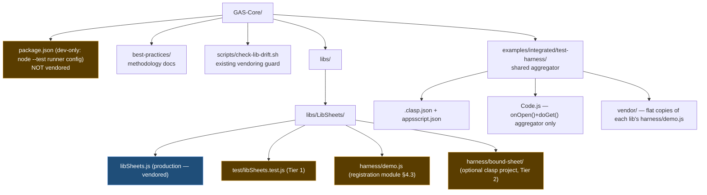
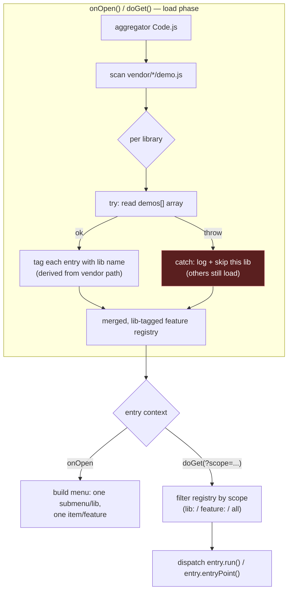
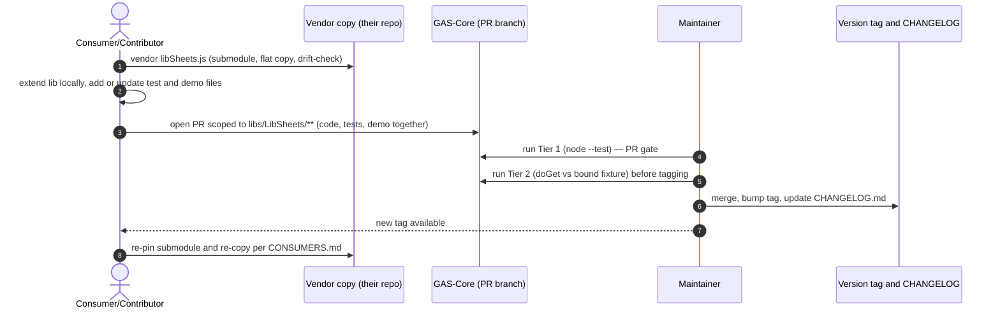

# GAS-Core Test & Demo Harness — Requirements & Design

Status: draft, iterating toward implementation.

> **Source-verification note.** Every claim in this document that asserts a
> fact about the existing repo is annotated with the file (and where useful,
> line range) it was checked against, e.g. `[libSheets.js:829–840]`. Claims
> were re-checked against source on 2026-06-17; if the cited code moves, the
> claim must be re-verified.

## 1. Context

GAS-Core hosts canonical, versioned libraries (`libs/`) consumed by multiple
Apps Script projects, plus documented reference patterns (`best-practices/`).
Libraries currently have no working deployable example and no regression
tests — a consumer can read the code but cannot see it run, and a contributor
proposing a change has no automated way to show it doesn't break existing
behavior.

As the repo's scope grows beyond Sheets (`LibSheets`, `LibSidebar`) toward
Docs, Forms, Calendar, web apps, and add-ons, this gap will only get more
expensive to close later. This document specifies a harness that gives every
library a runnable demo and a regression suite, scoped at both the
library and feature level, without duplicating harness infrastructure per
library.

## 2. Goals

- Every library has at least one **deployable example**: standalone
  (no bound resource), bound (runs against a real test Sheet/Doc), or both.
- Libraries can be demoed **together** in one integrated add-on deployment,
  not just individually.
- Library code, its tests, and its demo/menu wiring **live together** in
  `libs/<Name>/`, so a consumer who vendors the library can also vendor (or
  at least see) its tests and demos, and a PR improving the library naturally
  carries matching test/demo updates in the same diff.
- Test/demo execution is **scoped**: run everything, run one library, or run
  one feature within one library — at whichever tier (see §4) is being used.
- Adding a new library means adding files under `libs/<NewLib>/`; it must
  **not** require changes to a shared harness's core logic.
- A failing demo/test in one library must not prevent other libraries'
  demos/tests from running (no single point of failure in the aggregator).

## 3. Non-goals

- Replacing the existing documented patterns in `best-practices/`
  (`gas-acceptance-testing`, `gas-playwright-testing`) — this harness
  *applies* those patterns, it doesn't supersede them.
- Full CI automation against live Google resources on every PR. Tier 1 (see
  below) is the PR gate; bound/UI tiers are pre-release or periodic checks
  until we have a reliable service-account deployment story.
- Deciding now which Drive/account owns the test Sheet/Doc fixtures — that's
  an open question (§7), not a blocker for the design.

## 4. Design

### 4.0 Repo layout (overview)



Blue = vendored into consumer production deployments. Amber = dev/test/demo
material that stays in GAS-Core and is never vendored into production.

### 4.1 Per-library layout

```
libs/LibSheets/
  libSheets.js              production code (only this file gets vendored
                             into consumer projects, per CONSUMERS.md)
  CHANGELOG.md
  CONSUMERS.md
  test/
    libSheets.test.js        Tier 1: node:test, exercises the pure-logic
                             helpers re-exported by the dual-export guard
                             (see coverage boundary below)
  harness/
    demo.js                  registration module (see §4.3)
    bound-sheet/              optional: standalone clasp project
      .clasp.json              for a real bound-Sheet example
      appsscript.json
      Code.js
```

`test/` and `harness/` never get vendored into a consumer's production clasp
deployment — only `libSheets.js` does. No test/demo bloat in production.

**Tier 1 coverage boundary (correction).** Tier 1 runs in plain Node and can
only test code that does not touch `SpreadsheetApp`, `DocumentApp`, or other
GAS runtime globals — Node has no such globals. In `LibSheets` today the
dual-export guard at the bottom of the file re-exports **only the pure
header-mapping helpers**, not the stateful classes
[`libSheets.js:829–841`]:

```js
module.exports = {
  buildCaseInsensitiveHeaderMap_, normalizeManagedColumnSpec_,
  getManagedColumnHeader_, resolveManagedHeaderMap_,
  findRowIndexByNormalizedValue_, buildSharedHeaderCopyPlan_,
  sheetHasContent_,
};
```

`SpreadsheetManager`, `ManagedSheet`, and `ManagedConfigSheet`
[`libSheets.js:328`, `:465`, `:394`] call `SpreadsheetApp` and are therefore
**not Node-testable**; their behavior is covered at Tier 2 (bound harness)
and Tier 3 (UI), not Tier 1. Tier 1's job is the deterministic, side-effect-
free logic (header normalization, alias resolution, row lookup, copy
planning). Earlier drafts implied a Node test could "exercise ManagedSheet
header aliasing" directly — that is not achievable in Node and has been
corrected: Tier 1 exercises the extracted helpers that *implement* aliasing,
not the `SpreadsheetApp`-bound class that wraps them.

### 4.2 Shared integration harness

```
examples/integrated/test-harness/
  .clasp.json
  appsscript.json
  Code.js                    onOpen() + doGet(), aggregator only — no
                             library-specific logic
  vendor/                     flat copies of each lib's harness/demo.js,
                             kept in sync via the existing submodule +
                             pairs-file + check-lib-drift.sh mechanism
```

The aggregator's job is narrow: collect each vendored `demo.js`'s exported
feature list, wrap each library's registration in its own try/catch (so one
broken library doesn't take down `onOpen()` for the others), build the menu,
and route `doGet()` calls to the right feature by scope (§4.4).

**Correction (verified against the implementation, 2026-06-17):** earlier
language above ("collect... feature list") reads as if the aggregator
`require()`s each vendored `demo.js`, Node-style. That is not possible on the
real GAS V8 runtime: there is no `require()`/module resolution, and every
file in a clasp project loads into **one shared global scope**
[verified: developers.google.com/apps-script/guides/v8-runtime]. A bare
top-level `const demos = [...]` in two vendored files would also collide
("already declared") once more than one library is vendored side by side.
The implemented fix (`examples/integrated/test-harness/Code.js`,
`loadLibraryDemos_`): each vendored copy registers its `demos` array onto a
shared `var HARNESS_DEMOS_` global object, namespaced by library name (see
`vendor/LibSheets/demo.js`'s tail), and the aggregator reads
`HARNESS_DEMOS_[libName]` directly — no `require()` in the GAS path. A
`require()` fallback is kept only for local Node-side verification of the
aggregator's own routing logic outside a live GAS deployment; it is
unreachable in production. The canonical `libs/<Name>/harness/demo.js`
files are unaffected — only the flat vendored copy's registration tail
differs from the canonical source, by design.



This is the same vendoring mechanism already built for production libs
(`README.md` §"Consuming libs/ from an app project"
[`README.md:13–32`], `scripts/check-lib-drift.sh`), just pointed at
`harness/demo.js` files instead of production files.

**No-new-tooling claim (correction).** The *vendoring* side genuinely needs
no new tooling — the existing submodule + pairs-file + `check-lib-drift.sh`
mechanism handles syncing `harness/demo.js` copies with only additional
pairs-file entries [`scripts/check-lib-drift.sh:37–57`]. That is the only
sense in which "no new tooling" holds, and the claim is scoped to vendoring
accordingly. It does **not** extend to the test runner: GAS-Core currently
has **no `package.json`** (verified: none at repo root), and Tier 1 invokes
`node --test`, which expects a Node project. Tier 1 therefore requires a new,
**dev-only** `package.json` (and `node:test` / `node --test` wiring) that is
explicitly *not* vendored into any consumer deployment — see the dev
package.json note below and the amber node in §4.0.

**Dev `package.json` note.** Tier 1 needs a minimal root `package.json` whose
only purpose is to make `node --test` and per-library `test/` directories
resolve cleanly (e.g. `"type": "commonjs"` so the dual-export
`module.exports` guard works, plus a `"test": "node --test"` script). It
declares no runtime dependencies for the libraries themselves and is part of
the GAS-Core dev environment only; it is never copied into a consumer's clasp
`rootDir` and is excluded from vendoring (no pairs-file entry).

### 4.3 Registration module contract (I4)

Each `libs/<Name>/harness/demo.js` exports an array of entries. The contract is
specified at interface revision **I4**, which pins three things the earlier
sketch left implicit — the **entry-point signature**, the **completion
signal**, and the **output schema** — plus an optional **`kind`**
discriminator so the aggregator can render a feature the right way (menu
action, web-app route, or sidebar launch) without per-library special-casing.

```js
// libs/LibSheets/harness/demo.js  — I4
/**
 * @typedef {'menu'|'webapp'|'sidebar'} DemoKind
 *
 * @typedef {Object} DemoContext     // passed to entryPoint() by the aggregator
 * @property {string} scope          // resolved scope string, e.g. 'lib:LibSheets'
 * @property {'menu'|'doGet'} trigger // how this invocation was reached
 * @property {Object} [params]       // parsed doGet query params (Tier 2)
 *
 * @typedef {Object} DemoResult      // the completion signal + output schema
 * @property {'ok'|'error'} status   // REQUIRED completion signal
 * @property {string} feature        // echo of the feature id that ran
 * @property {string} [message]      // human-readable summary (shown in UI/log)
 * @property {Object} [data]         // structured, JSON-serializable output
 * @property {string} [error]        // present iff status === 'error'
 *
 * @typedef {Object} DemoEntry
 * @property {string} feature        // stable id, unique within the library
 * @property {string} menuLabel      // label for onOpen() menu / webapp link text
 * @property {DemoKind} [kind]       // optional; defaults to 'menu' if omitted
 * @property {(ctx: DemoContext) => DemoResult} entryPoint  // see signature below
 */

/** @type {DemoEntry[]} */
const demos = [
  {
    feature: 'headerAliasing',
    menuLabel: 'LibSheets: Header Aliasing Demo',
    kind: 'menu',
    // entry-point signature: (ctx: DemoContext) => DemoResult
    entryPoint: (ctx) => {
      const result = SpreadsheetApp.getActive(); // bound-sheet demo (Tier 2)
      // ... exercise the SpreadsheetApp-bound ManagedSheet wrapper here;
      //     the pure aliasing logic it calls is what Tier 1 unit-tests ...
      return { status: 'ok', feature: 'headerAliasing',
               message: 'Aliased 3 headers', data: { aliased: 3 } };
    },
  },
  {
    feature: 'configSheet',
    menuLabel: 'LibSheets: Config Sheet Demo',
    kind: 'webapp',
    entryPoint: (ctx) => ({ status: 'ok', feature: 'configSheet' }),
  },
];
```

**I4 contract elements:**

| Element | Spec |
|---|---|
| **Entry-point signature** | `entryPoint(ctx: DemoContext) => DemoResult`. A single context argument (replacing the old zero-arg `run`) so the same function serves both `onOpen()` menu clicks and `doGet()` calls; `ctx.trigger` tells the demo which it is, `ctx.params` carries doGet query state. |
| **Completion signal** | The returned `DemoResult.status` (`'ok'` \| `'error'`) is the explicit success/failure signal. The aggregator never infers success from "didn't throw" — a demo that returns `status:'error'` is reported as failed without aborting other demos. A thrown exception is also caught (try/catch isolation, §4.2) and normalized to `status:'error'`. |
| **Output schema** | `DemoResult` is JSON-serializable so Tier 2 `doGet()` can return it as the HTTP response body and Tier 3 can assert on it. `data` carries structured per-demo output; `message` is the human-readable line shown in menus/logs. |
| **`kind` discriminator (optional)** | `'menu'` (default) → wired as an `onOpen()` menu item; `'webapp'` → exposed as a `doGet()` route only; `'sidebar'` → launches an HTML sidebar (e.g. `LibSidebar`'s `NotificationSidebar.html` [`libs/LibSidebar/NotificationSidebar.html`]). Omitting `kind` yields `'menu'`, so existing entries need no change. |

The aggregator tags each entry with its library name automatically (from the
vendored path), so scoping by library requires no extra bookkeeping in the
registration module itself — a library only ever declares what it has.

**Backward note:** `kind` and the richer `entryPoint`/`DemoResult` are the I4
delta over the I3 sketch (zero-arg `run`, no completion signal). A library can
adopt I4 incrementally: `kind` defaults to `menu`, and the migration is purely
additive within each `harness/demo.js`.

### 4.4 Scoping, by tier

| Tier | Mechanism | Scope to one library | Scope to one feature |
|---|---|---|---|
| 1 — Node unit tests | `node --test` | `node --test libs/LibSheets/test/` | `--test-name-pattern` or per-feature `describe` blocks |
| 2 — doGet/menu (bound harness) | query string on the aggregator's `doGet()` | `?scope=lib:LibSheets` | `?scope=lib:LibSheets,feature:headerAliasing` |
| 2 — menu (interactive) | `onOpen()` menu structure | one submenu per library | one menu item per feature |
| 3 — Playwright (UI-level) | spec file + tag, organized per library | one spec file per library | tag filter within a spec |

`?scope=all` runs everything at Tier 2. The filtering logic for Tier 2 lives
once in the aggregator; libraries never need to know about scope syntax.

### 4.5 Tiering policy

```mermaid
graph LR
  subgraph T1["Tier 1 — Node"]
    direction TB
    t1a["node --test"]
    t1b["pure helpers only<br/>(no SpreadsheetApp)"]
    t1c["gate: every PR<br/>touching a library"]
  end
  subgraph T2["Tier 2 — bound harness"]
    direction TB
    t2a["doGet() against<br/>bound test Sheet/Doc"]
    t2b["real SpreadsheetApp /<br/>DocumentApp behavior"]
    t2c["gate: before<br/>version-tag bump"]
  end
  subgraph T3["Tier 3 — UI"]
    direction TB
    t3a["Playwright drives<br/>deployed harness UI"]
    t3b["menu clicks, dialogs,<br/>nested iframes"]
    t3c["gate: periodic /<br/>manual smoke"]
  end
  T1 -->|"escalating fidelity,<br/>cost & brittleness"| T2 --> T3

  classDef fast fill:#1f4e2f,stroke:#9ee0b5,color:#ffffff;
  classDef mid fill:#1f4e79,stroke:#9ec5fe,color:#ffffff;
  classDef slow fill:#5a3d00,stroke:#ffd27d,color:#ffffff;
  class t1a,t1b,t1c fast;
  class t2a,t2b,t2c mid;
  class t3a,t3b,t3c slow;
```



Execution context per tier: Tier 1 = plain Node (no GAS runtime), Tier 2 =
deployed GAS web app reached via `doGet()`, Tier 3 = browser driving the live
Sheets/Docs editor UI.

- **Tier 1 (required on every PR touching a library):** fast, no live Google
  resources, runs in plain Node. This is the regression-test bar referenced
  in the consumer-PR workflow — a contributor proposing a library change is
  expected to add or update `test/` alongside the code change. Constrained to
  the dual-export pure helpers (§4.1 coverage boundary); `SpreadsheetApp`-
  bound classes are covered at Tier 2+, not here.
- **Tier 2 (run before bumping a library's version tag):** exercises real
  Sheets/Docs API behavior against the bound test fixture via `doGet()`,
  reusing the entry-point-as-call-site technique from
  `best-practices/gas-acceptance-testing`.
- **Tier 3 (periodic/manual smoke test):** Playwright drives the actual
  deployed harness UI (real menu clicks, dialogs), reusing
  `best-practices/gas-playwright-testing`. Slower and more brittle than Tier
  2 since it drives the full Sheets/Docs UI inside nested iframes, not just a
  doGet endpoint — not a default gate.

## 5. Consumer / contributor PR flow



1. Consumer vendors `libs/LibSheets/libSheets.js` into their project as
   today (submodule + flat copy + drift-check).
2. Consumer extends the library locally, adding/updating
   `libs/LibSheets/test/` and `libs/LibSheets/harness/demo.js` to cover the
   new behavior.
3. Consumer opens a PR against GAS-Core scoped to `libs/LibSheets/**` —
   code, tests, and demo registration land together, reviewable as one unit.
4. Maintainer runs Tier 1 locally/CI; runs Tier 2 against the bound fixture
   before bumping the version tag; merges, tags, updates `CHANGELOG.md`.
5. Consumer re-pins to the new tag per the existing `CONSUMERS.md` flow.

## 6. Why this shape (alternatives considered)

| Alternative | Rejected because |
|---|---|
| One harness per library (fully separate bound projects) | Duplicates `onOpen()`/`doGet()` boilerplate per library; no shared "demo everything together" story for add-on-style integration testing. |
| Single top-level `examples/` tree mirroring lib names, separate from `libs/` | Splits "how do I use LibSheets" across two trees; PRs touching a library's behavior and its demo land in different directories. |
| Central registry file listing all libraries' demos | Creates a single file every library PR must touch — merge-conflict prone when multiple library PRs land close together. Rejected in favor of each library self-declaring via its own `harness/demo.js`. |

### 6.1 Why adding a library needs no aggregator core change (proof)

Goal 5 (§2) and phasing step 3 (§8) both assert that adding a library requires
**no change to the aggregator's core logic**. This holds by construction:

1. **Discovery is by directory scan, not by an enumerated list.** The
   aggregator iterates over whatever `vendor/*/demo.js` files are present
   (§4.2 load phase); a new library appears simply because a new vendored copy
   exists. No symbol in the aggregator names any specific library.
2. **Library identity is derived from the path, not declared in core.** Each
   entry is tagged with its library name from the vendored path (§4.3), so the
   scope filter (`lib:<Name>`) works for an unseen library with no new code.
3. **The contract is uniform (I4).** Every `demo.js` exposes the same
   `DemoEntry[]` shape with the same `entryPoint`/`DemoResult` signature
   (§4.3). The aggregator dispatches against the interface, not against any
   library's internals; `kind` covers menu/webapp/sidebar rendering generically.
4. **Isolation is per-library and uniform.** The try/catch wraps *each*
   library's load (§4.2), so a new (or broken) library can only affect itself.

The only files that change when adding a library are: the new
`libs/<NewLib>/harness/demo.js`, the consumer/aggregator **pairs-file**
(one new line, data not code [`scripts/check-lib-drift.sh:37`]), and the
vendored flat copy the drift check keeps in sync. None of these is aggregator
core logic. Phasing step 3 ("add `LibSidebar`'s `harness/demo.js`, confirm the
aggregator needed no core changes") is therefore a *verification* of this
property, not a hoped-for outcome.

## 7. Open questions

The items below are split into **resolved decisions** (recorded so they are not
re-litigated) and **genuinely open** items (need a human decision or later
work). Earlier drafts mixed the two under one heading.

### 7.1 Resolved (recorded leanings, not blockers)

- **Versioning of `harness/demo.js`:** a demo-only change (no production code
  change in `libSheets.js`) gets a `CHANGELOG.md` note but **no version-tag
  bump**. A tag bump is reserved for changes to the vendored production file.
- **Tier 1 / Tier 2 scope boundary:** decided per §4.1 — Node-testable pure
  helpers at Tier 1, `SpreadsheetApp`-bound behavior at Tier 2+. Not reopened.

### 7.2 Open (need a decision or later work)

- **Test fixture ownership:** the bound Sheet/Doc IDs used by Tier 2/3 need a
  home — a dedicated shared-drive folder, **not** personal Drive. Account/Drive
  TBD by the user. *Blocks Tier 2 execution, not the design.*
- **Tier 2 CI automation:** running `doGet()`-based acceptance checks today is
  manual; a service-account-driven CI job is a later enhancement, not required
  for the initial harness.
- **Dev `package.json` placement:** confirmed needed (§4.2), but whether the
  `node --test` config lives at repo root or under a `dev/` subtree is an open
  layout call to settle when Tier 1 is scaffolded.

## 8. Suggested phasing

1. Scaffold `test/` + `harness/demo.js` for `LibSheets` only (smallest,
   already has consumers) — prove the per-library layout and Tier 1 runner.
2. Build the shared `examples/integrated/test-harness/` aggregator against
   that one library — prove vendoring + scoping + try/catch isolation.
3. Add `LibSidebar`'s `harness/demo.js`, confirm the aggregator needed no
   core changes.
4. Add a bound-sheet example + Tier 2 `doGet()` acceptance check for
   `LibSheets`, reusing `gas-acceptance-testing`.
5. Add a Tier 3 Playwright smoke spec against the deployed harness, reusing
   `gas-playwright-testing`.
6. Document the contributor flow (§5) in `README.md` once proven.

## 9. SDLC alignment

The harness is not a new process; it slots into existing GAS-Core practices and
the documented `best-practices/` patterns. This table maps each SDLC phase to
the harness mechanism that serves it and the canonical practice it reuses.

| SDLC phase | Harness mechanism | GAS-Core practice / source it reuses |
|---|---|---|
| Design / interface | I4 registration contract (§4.3): fixed `entryPoint`/`DemoResult`, optional `kind` | This document; uniform contract keeps the aggregator library-agnostic (§6.1) |
| Implement | Library code + co-located `test/` + `harness/demo.js` in `libs/<Name>/` | Per-library layout (§4.1); vendoring stays production-only |
| Unit verify | Tier 1 `node --test` on pure helpers | Dual-export guard [`libSheets.js:829–841`]; `best-practices/gas-editor-testing` |
| Integration verify | Tier 2 `doGet()` against bound fixture | `best-practices/gas-acceptance-testing` (entry-point-as-call-site) |
| UI / acceptance | Tier 3 Playwright smoke | `best-practices/gas-playwright-testing` (helpers + config example present) |
| Release | Version-tag bump + `CHANGELOG.md`; drift re-pin | `README.md` consuming flow [`README.md:13–32`]; `CONSUMERS.md` per lib |
| Maintain / guard | `scripts/check-lib-drift.sh` over pairs-file | Existing drift tooling [`scripts/check-lib-drift.sh`] |
| Report | `DemoResult` output schema → logs / doGet body | Tier 2 response body; `best-practices/gas-test-reporting` |

No SDLC phase introduces a bespoke process: each row is an existing practice
pointed at harness artifacts.

## 10. Ceremony calibration

### 10.1 Keeping it lightweight

The harness is deliberately calibrated to the smallest ceremony that still
delivers a runnable demo and a regression bar:

- **One contract, additive evolution.** I4 adds `kind` and a result schema
  over the prior sketch, but every change is additive and `kind` defaults to
  `menu` (§4.3) — no existing demo must be rewritten to comply.
- **No central registry.** Each library self-declares via its own
  `harness/demo.js`; there is no shared file every PR must edit (§6, rejected
  alternative), which removes a recurring merge-conflict ceremony.
- **Tier 1 is the only mandatory gate.** Tier 2/3 are pre-release or periodic
  (§4.5), so day-to-day PR ceremony is just `node --test` plus the existing
  drift check — both already local, both fast.
- **Reuse over invention.** No new sync tooling (vendoring side, §4.2); the dev
  `package.json` is the single genuinely-new artifact, and it is dev-only.
- **Isolation removes blast-radius ceremony.** Per-library try/catch (§4.2)
  means a broken demo needs no coordinated rollback — it self-contains.

### 10.2 Reuse & calibration anchors

The ceremony level is anchored to concrete, already-present reference points so
it neither over- nor under-engineers:

- **Anchor: the existing vendoring mechanism** [`scripts/check-lib-drift.sh`,
  `README.md:13–32`]. The harness adds pairs-file *entries*, not a new sync
  system — calibration target is "same effort as adding a production lib."
- **Anchor: the documented testing practices** (`gas-acceptance-testing`,
  `gas-playwright-testing`, `gas-editor-testing`). Each tier reuses an existing
  pattern rather than defining a new test methodology (§3 non-goals, §9 table).
- **Anchor: the dual-export guard already in `libSheets.js`**
  [`libSheets.js:829–841`]. Tier 1 calibrates to "test what is already
  Node-reachable," not "refactor classes to be Node-testable."
- **Anchor: the per-lib `CHANGELOG.md` + tag flow.** Release ceremony for a
  harness change is exactly the consumer flow already in `CONSUMERS.md`; demo-
  only changes are explicitly de-escalated to a changelog note (§7.1).

These anchors are the calibration test: if a proposed harness addition would
require ceremony heavier than its anchor, that is the signal to push the
addition into a later phase (§8) or reject it.
