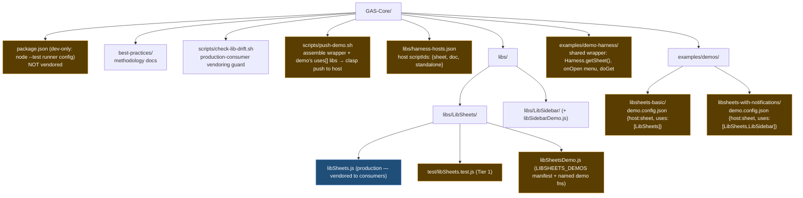
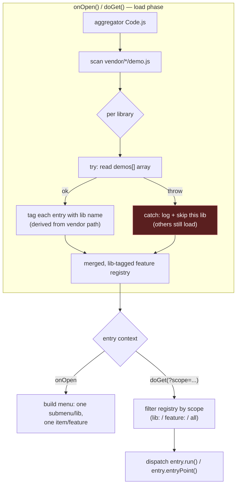
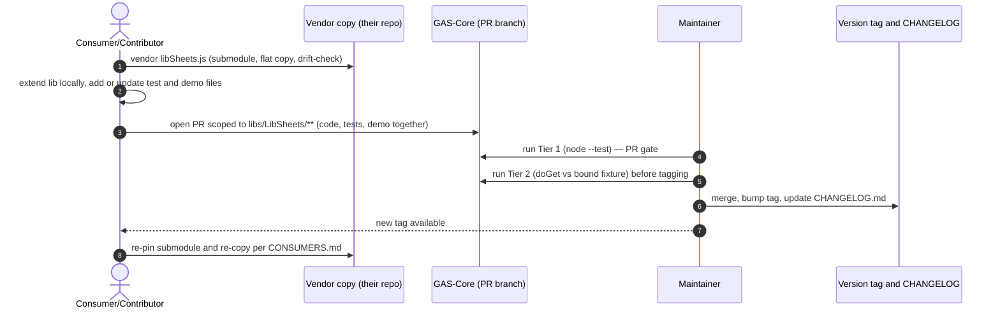

# GAS-Core Test & Demo Harness — Requirements & Design

Status: draft, iterating toward implementation.

> **Source-verification note.** Every claim in this document that asserts a
> fact about the existing repo is annotated with the file (and where useful,
> line range) it was checked against, e.g. `[libSheets.js:829–840]`. Claims
> were re-checked against source on 2026-06-17; if the cited code moves, the
> claim must be re-verified.

---

> ## ⚠️ Design revision — 2026-06-18: per-library harnesses (supersedes the shared aggregator)
>
> **Decision.** Drop the single shared integration aggregator
> (`examples/integrated/test-harness/`, §4.2) in favour of **one standalone
> harness per library**. Each `libs/<Name>/` carries its own small clasp
> harness — a bound test Sheet/Doc, its own `onOpen()`/`doGet()`, and a plain
> top-level `const demos = [...]` — deployed and demoed on its own.
>
> **Why.** The aggregator hosts every library's `demo.js` in one clasp project,
> but the GAS V8 runtime loads every file in a project into **one shared global
> scope** with no `require()`. That single fact forced a chain of machinery
> whose only payoff was "show all libraries at one URL":
> - `HARNESS_DEMOS_` namespacing (to avoid colliding `const demos`);
> - vendoring each `harness/demo.js` into the aggregator's `vendor/` tree;
> - `scripts/copy-demo-files.sh` *generating* each vendored copy (canonical body
>   + a spliced registration tail) via embedded string-surgery;
> - `scripts/check-lib-drift.sh` intra-repo mode + regen-command field +
>   pairs-file, purely to police a generated file against its own generator.
>
> The cost did not buy the thing demos are *for*: the per-feature interactive
> menu click (`runMenuDemo_`, `Code.js:270`) is a non-functional no-op — GAS
> menu items cannot carry arguments and V8 cannot generate named handlers
> dynamically, so the aggregator only ever offered "run all" + a `doGet`
> automation route, not click-to-run-one-feature. A per-library harness is a
> single small file, so its menu items *can* each bind a hand-written named
> handler — the interactive demo experience actually works.
>
> **What this changes below.** §2 goals, §4.0 layout, §4.2 (aggregator), §4.3
> framing (no `HARNESS_DEMOS_` / no vendoring), §4.4 scoping (per-lib `doGet`,
> not aggregator routing), §6/§6.1 (the no-core-change proof is moot — there is
> no shared core), and §8 phasing are all revised or superseded by this
> decision. Sections kept verbatim where still correct: §4.1 per-library layout,
> §4.5 tiering, §3 non-goals.
>
> **What is unaffected and retained.** Tier 1 `node --test` on pure helpers (the
> regression net) and the **production-consumer** submodule + flat-copy +
> `check-lib-drift.sh` mechanism (anti-fork for real `libSheets.js` across
> consumers, `README.md` §"Consuming libs/") — both are independent of the demo
> harness and stay as-is.
>
> Tracking: bd memory `test-demo-harness-architecture-pivot-2026-06-18`; epic
> `GAS-Core-pos`.

> ### Follow-on refinement — 2026-06-18b/c: hybrid (co-located demo logic + shared wrapper + composed deployable demos)
>
> The unit of **deployment** is a *demo* that composes **one or more** libraries
> (examples: `libsheets-basic` uses `LibSheets`; `libsheets-with-notifications`
> uses `LibSheets` + `LibSidebar`; no sidebar-only demo — demos are authored as
> needed). But the unit of **authoring** is co-located with the library, so a
> contributor adding a feature touches only `libs/<Name>/`:
>
> - **Demo logic lives WITH the library:** `libs/<Name>/<name>Demo.js` declares a
>   library-prefixed manifest + named demo functions, e.g.
>   `var LIBSHEETS_DEMOS = [{ name: 'Demo Sheets', demo: 'libSheets_sheetDemo' }];`
>   plus `function libSheets_sheetDemo() { var ss = Harness.getSheet(); … }`. So
>   `libs/<Name>/` holds production code + `test/` + `<name>Demo.js`.
> - **A small shared wrapper** (`examples/demo-harness/`) is pushed with every
>   demo and provides environment + plumbing: `Harness.getSheet()` (bound active
>   sheet, or a sheet resolved by id), the `onOpen()` menu builder, and the
>   `doGet()` router. It builds menus by iterating each loaded library's
>   `<LIB>_DEMOS` and binding `menu.addItem(name, e.demo)`.
> - **A demo is a thin composition declaration:** `examples/demos/<demo>/
>   demo.config.json = { host, uses[] }` (+ optional cross-library glue
>   `Code.js`). Single-library demos need little or nothing here.
>
> **Why the menu now actually works (the aggregator's worst defect, fixed).** The
> aggregator stored demos as anonymous `entryPoint:(ctx)=>{}` closures in a data
> array — a GAS menu item cannot bind to those (it binds a *named* zero-arg
> global). Here `demo` is a **string naming a real global function**, so
> `menu.addItem(name, 'libSheets_sheetDemo')` binds and click-to-run works. The
> environment arrives via the `Harness.getSheet()` accessor, not a click
> argument, so demo functions stay zero-arg and bindable.
>
> **Reusable hosts + push tool.** A small fixed set of clasp host projects, keyed
> by container type (`sheet`, `doc`, `standalone` if needed), is owned once;
> scriptIds live in `libs/harness-hosts.json`. `scripts/push-demo.sh <demo>`
> reads `demo.config.json`, assembles the shared wrapper + each `uses` library's
> source (`libs/<Name>/*.js`) + each library's `<name>Demo.js` into a temp dir,
> and `clasp push`es to the host for its `host` kind. One demo live per host at a
> time ("push only the demo we want").
>
> **Still not the aggregator.** Only the chosen demo's libraries load into a
> host's global scope, so there is no demo vendoring and no drift check for
> demos. The `<LIB>_DEMOS` registry is fine — the registry was never the problem;
> vendoring + always-all-libs + non-bindable closures were, and all three stay
> gone. Composing two libraries is safe: `libName_`-prefixed manifests/functions
> don't collide (the rejected collision was many files each declaring a bare
> `const demos`).
>
> **Trade-offs (accepted):** authoring a *new composed* demo still touches
> `examples/demos/<demo>/` (composition is inherently cross-library); demo
> function names must be `libName_`-prefixed; the wrapper is shared infrastructure
> with a small stable contract. Also: demo functions currently embedded in the
> vendored `libSheets.js` (lines ~43–144) must be extracted to
> `libs/LibSheets/libSheetsDemo.js` — which also removes demo bloat from the
> vendored production file.
>
> Supersedes below: §2 goals, §4.0/§4.1 layout, §4.3 contract, §8 phasing.
> Tracking: bd memory `test-demo-harness-hybrid-model-2026-06-18` (authoritative;
> supersedes the two earlier harness memories).

---

## 1. Context

GAS-Core hosts canonical, versioned libraries (`libs/`) consumed by multiple
Apps Script projects, plus documented reference patterns (`best-practices/`).
Libraries currently have no working deployable example and no regression
tests — a consumer can read the code but cannot see it run, and a contributor
proposing a change has no automated way to show it doesn't break existing
behavior.

As the repo's scope grows beyond Sheets (`LibSheets`, `LibSidebar`) toward
Docs, Forms, Calendar, web apps, and add-ons, this gap will only get more
expensive to close later. This document specifies a harness that gives every
library a runnable demo and a regression suite, scoped at both the
library and feature level, without duplicating harness infrastructure per
library.

## 2. Goals

(Revised per the 2026-06-18b/c hybrid refinement.)

- There is at least one **deployable demo** per capability worth showing. A demo
  composes one or more libraries and runs against the appropriate reusable host
  (bound Sheet/Doc, or standalone). Demos are authored as needed — not one per
  library.
- A demo is deployed and demoed **on its own**: `push-demo <demo>` loads exactly
  that demo (and only the libraries it `uses`) into a host, so a person opens it,
  sees those features, and clicks to run one (working per-feature menu items).
- **Adding a feature's demo touches only `libs/<Name>/`.** A library's demo logic
  is co-located with its code: production + Tier 1 `test/` + `<name>Demo.js` all
  live in `libs/<Name>/`. A contributor need not check out or edit the wider demo
  tree to add a demo for the feature they just wrote.
- A demo's *composition* (which libraries, which host) is declared separately in
  `examples/demos/<demo>/demo.config.json`; the shared wrapper in
  `examples/demo-harness/` supplies the runtime environment (e.g. the sheet) and
  the menu/`doGet` plumbing so libraries don't reimplement it.
- Test/demo execution is **scoped within a demo**: run all of a demo's features
  or one feature, at whichever tier (§4) is being used.
- A failing demo is inherently isolated — each demo is its own push to its own
  host, so there is no shared single point of failure to guard against.

## 3. Non-goals

- Replacing the existing documented patterns in `best-practices/`
  (`gas-acceptance-testing`, `gas-playwright-testing`) — this harness
  *applies* those patterns, it doesn't supersede them.
- Full CI automation against live Google resources on every PR. Tier 1 (see
  below) is the PR gate; bound/UI tiers are pre-release or periodic checks
  until we have a reliable service-account deployment story.
- Deciding now which Drive/account owns the test Sheet/Doc fixtures — that's
  an open question (§7), not a blocker for the design.

## 4. Design

### 4.0 Repo layout (overview)

Revised per the 2026-06-18b/c hybrid decision: a library carries its own demo
logic (`<name>Demo.js`) next to its production code + `test/`; a shared wrapper
(`examples/demo-harness/`) supplies environment + menu/`doGet`; `examples/demos/`
holds thin composition configs; the push tool assembles wrapper + chosen demo's
`uses` libraries (source + `<name>Demo.js`) and pushes to a reusable host.



Blue = vendored into consumer production deployments. Amber = dev/test/demo
material that stays in GAS-Core and is never vendored into production
(`<name>Demo.js` included — it is co-located with the library but never shipped).

### 4.1 Library + demo layout

Revised 2026-06-18b/c (hybrid): a library directory holds production code +
`test/` + its own co-located `<name>Demo.js`; composition lives in
`examples/demos/`; the shared wrapper lives in `examples/demo-harness/`.

```
libs/LibSheets/
  libSheets.js              production code (only this file gets vendored
                             into consumer projects, per CONSUMERS.md)
  libSheetsDemo.js          co-located demo logic: a library-prefixed manifest
                             `var LIBSHEETS_DEMOS = [{ name, demo:'libSheets_…' }]`
                             + named demo functions that read env from Harness.
                             Never vendored to consumers.
  CHANGELOG.md
  CONSUMERS.md
  test/
    libSheets.test.js        Tier 1: node:test, exercises the pure-logic
                             helpers re-exported by the dual-export guard
                             (see coverage boundary below)

examples/demo-harness/       shared wrapper (pushed with every demo):
  harness.js                 Harness.getSheet(), onOpen() menu builder over each
                             loaded library's <LIB>_DEMOS, doGet() router

libs/harness-hosts.json      host scriptIds, owned once: { "sheet": "<id>",
                             "doc": "<id>", "standalone": "<id>" }

examples/demos/
  libsheets-basic/
    demo.config.json         { "host": "sheet", "uses": ["LibSheets"] }
  libsheets-with-notifications/
    demo.config.json         { "host": "sheet", "uses": ["LibSheets","LibSidebar"] }
    Code.js                  OPTIONAL cross-library glue only
```

`scripts/push-demo.sh <demo>` reads `examples/demos/<demo>/demo.config.json`,
copies the shared wrapper + each `uses` library's source (`libs/<Name>/*.js`,
which includes its `<name>Demo.js`) into a temp build dir, writes a transient
`.clasp.json` whose `scriptId` is `libs/harness-hosts.json[host]`, and runs
`clasp push`. Nothing committed can drift; the only persistent config is the
host scriptIds.

`test/` and `<name>Demo.js` never get vendored into a consumer's production
clasp deployment — only `libSheets.js` does. Demos are never vendored at all.

**Tier 1 coverage boundary (correction).** Tier 1 runs in plain Node and can
only test code that does not touch `SpreadsheetApp`, `DocumentApp`, or other
GAS runtime globals — Node has no such globals. In `LibSheets` today the
dual-export guard at the bottom of the file re-exports **only the pure
header-mapping helpers**, not the stateful classes
[`libSheets.js:829–841`]:

```js
module.exports = {
  buildCaseInsensitiveHeaderMap_, normalizeManagedColumnSpec_,
  getManagedColumnHeader_, resolveManagedHeaderMap_,
  findRowIndexByNormalizedValue_, buildSharedHeaderCopyPlan_,
  sheetHasContent_,
};
```

`SpreadsheetManager`, `ManagedSheet`, and `ManagedConfigSheet`
[`libSheets.js:328`, `:465`, `:394`] call `SpreadsheetApp` and are therefore
**not Node-testable**; their behavior is covered at Tier 2 (bound harness)
and Tier 3 (UI), not Tier 1. Tier 1's job is the deterministic, side-effect-
free logic (header normalization, alias resolution, row lookup, copy
planning). Earlier drafts implied a Node test could "exercise ManagedSheet
header aliasing" directly — that is not achievable in Node and has been
corrected: Tier 1 exercises the extracted helpers that *implement* aliasing,
not the `SpreadsheetApp`-bound class that wraps them.

### 4.2 Shared integration harness — ⚠️ SUPERSEDED (2026-06-18)

> **Superseded by the 2026-06-18 revision (top of doc).** This whole section
> describes the shared aggregator that has been dropped. It is retained for
> rationale/history only — the `HARNESS_DEMOS_` namespacing, the `vendor/` demo
> copies, `scripts/copy-demo-files.sh`, and the `check-lib-drift.sh` intra-repo
> mode it relies on are **no longer part of the design**. Each library now has
> its own standalone harness instead (§4.0, §4.1). Skip to §4.3 for the
> still-current registration shape and §4.5 for tiering.

```
examples/integrated/test-harness/
  .clasp.json
  appsscript.json
  Code.js                    onOpen() + doGet(), aggregator only — no
                             library-specific logic
  vendor/                     flat copies of each lib's harness/demo.js,
                             kept in sync via the existing submodule +
                             pairs-file + check-lib-drift.sh mechanism
```

The aggregator's job is narrow: collect each vendored `demo.js`'s exported
feature list, wrap each library's registration in its own try/catch (so one
broken library doesn't take down `onOpen()` for the others), build the menu,
and route `doGet()` calls to the right feature by scope (§4.4).

**Correction (verified against the implementation, 2026-06-17):** earlier
language above ("collect... feature list") reads as if the aggregator
`require()`s each vendored `demo.js`, Node-style. That is not possible on the
real GAS V8 runtime: there is no `require()`/module resolution, and every
file in a clasp project loads into **one shared global scope**
[verified: developers.google.com/apps-script/guides/v8-runtime]. A bare
top-level `const demos = [...]` in two vendored files would also collide
("already declared") once more than one library is vendored side by side.
The implemented fix (`examples/integrated/test-harness/Code.js`,
`loadLibraryDemos_`): each vendored copy registers its `demos` array onto a
shared `var HARNESS_DEMOS_` global object, namespaced by library name (see
`vendor/LibSheets/demo.js`'s tail), and the aggregator reads
`HARNESS_DEMOS_[libName]` directly — no `require()` in the GAS path. A
`require()` fallback is kept only for local Node-side verification of the
aggregator's own routing logic outside a live GAS deployment; it is
unreachable in production. The canonical `libs/<Name>/harness/demo.js`
files are unaffected — only the flat vendored copy's registration tail
differs from the canonical source, by design.



This is the same vendoring mechanism already built for production libs
(`README.md` §"Consuming libs/ from an app project"
[`README.md:13–32`], `scripts/check-lib-drift.sh`), just pointed at
`harness/demo.js` files instead of production files.

**No-new-tooling claim (correction).** The *vendoring* side genuinely needs
no new tooling — the existing submodule + pairs-file + `check-lib-drift.sh`
mechanism handles syncing `harness/demo.js` copies with only additional
pairs-file entries [`scripts/check-lib-drift.sh:37–57`]. That is the only
sense in which "no new tooling" holds, and the claim is scoped to vendoring
accordingly. It does **not** extend to the test runner: GAS-Core currently
has **no `package.json`** (verified: none at repo root), and Tier 1 invokes
`node --test`, which expects a Node project. Tier 1 therefore requires a new,
**dev-only** `package.json` (and `node:test` / `node --test` wiring) that is
explicitly *not* vendored into any consumer deployment — see the dev
package.json note below and the amber node in §4.0.

**Dev `package.json` note.** Tier 1 needs a minimal root `package.json` whose
only purpose is to make `node --test` and per-library `test/` directories
resolve cleanly (e.g. `"type": "commonjs"` so the dual-export
`module.exports` guard works, plus a `"test": "node --test"` script). It
declares no runtime dependencies for the libraries themselves and is part of
the GAS-Core dev environment only; it is never copied into a consumer's clasp
`rootDir` and is excluded from vendoring (no pairs-file entry).

### 4.3 Demo registration shape (I4 → hybrid manifest)

> **Revised 2026-06-18b/c (hybrid) — supersedes the closure-based `entryPoint`
> shape shown in the rest of this section.** Each library co-locates its demos in
> `libs/<Name>/<name>Demo.js` as a **library-prefixed manifest of named global
> functions**, not a closure array:
>
> ```js
> // libs/LibSheets/libSheetsDemo.js
> var LIBSHEETS_DEMOS = [
>   { name: 'Demo Sheets', demo: 'libSheets_sheetDemo', kind: 'menu' },
> ];
> function libSheets_sheetDemo() {          // named global, zero-arg, libName_-prefixed
>   var ss = Harness.getSheet();            // environment from the shared wrapper
>   // ... exercise LibSheets against ss ...
>   return { status: 'ok', message: '…' };  // DemoResult still used for doGet/Tier 2
> }
> ```
>
> Two deliberate changes from the original I4 closure form below:
> 1. **`demo` is a string naming a real global function**, not an anonymous
>    `entryPoint: (ctx)=>{}` closure. This is what makes `menu.addItem(name,
>    e.demo)` actually bind and run on click (GAS binds menu items to *named*
>    globals only — the closure form could not be bound, which is why the
>    aggregator's per-feature menu was a no-op).
> 2. **Environment is pulled, not pushed.** A demo function takes no arguments
>    and reads what it needs from the shared `Harness` (`Harness.getSheet()`),
>    instead of receiving a `ctx` argument — keeping it zero-arg and bindable.
>
> The shared wrapper (`examples/demo-harness/`) iterates each loaded library's
> `<LIB>_DEMOS`, builds the menu, and for `doGet`/Tier 2 calls the named function
> and returns its `DemoResult`. The `DemoResult`/`kind` definitions below still
> apply; the `DemoContext`/`entryPoint` closure signature does not.

> **(Historical, 2026-06-18 — superseded by the hybrid note above.)** The
> `DemoEntry`/`DemoResult` shape below was the per-library-harness form: a plain
> top-level `const demos = [...]` of `entryPoint` closures, no `HARNESS_DEMOS_`,
> consumed by that library's own `Code.js`. Retained for the `DemoResult`/`kind`
> field definitions, which the hybrid still uses.

Each library's harness declares an array of demo entries. The contract is
specified at interface revision **I4**, which pins three things the earlier
sketch left implicit — the **entry-point signature**, the **completion
signal**, and the **output schema** — plus an optional **`kind`**
discriminator so the harness can render a feature the right way (menu
action, web-app route, or sidebar launch) without special-casing.

```js
// libs/LibSheets/harness/demo.js  — I4
/**
 * @typedef {'menu'|'webapp'|'sidebar'} DemoKind
 *
 * @typedef {Object} DemoContext     // passed to entryPoint() by the aggregator
 * @property {string} scope          // resolved scope string, e.g. 'lib:LibSheets'
 * @property {'menu'|'doGet'} trigger // how this invocation was reached
 * @property {Object} [params]       // parsed doGet query params (Tier 2)
 *
 * @typedef {Object} DemoResult      // the completion signal + output schema
 * @property {'ok'|'error'} status   // REQUIRED completion signal
 * @property {string} feature        // echo of the feature id that ran
 * @property {string} [message]      // human-readable summary (shown in UI/log)
 * @property {Object} [data]         // structured, JSON-serializable output
 * @property {string} [error]        // present iff status === 'error'
 *
 * @typedef {Object} DemoEntry
 * @property {string} feature        // stable id, unique within the library
 * @property {string} menuLabel      // label for onOpen() menu / webapp link text
 * @property {DemoKind} [kind]       // optional; defaults to 'menu' if omitted
 * @property {(ctx: DemoContext) => DemoResult} entryPoint  // see signature below
 */

/** @type {DemoEntry[]} */
const demos = [
  {
    feature: 'headerAliasing',
    menuLabel: 'LibSheets: Header Aliasing Demo',
    kind: 'menu',
    // entry-point signature: (ctx: DemoContext) => DemoResult
    entryPoint: (ctx) => {
      const result = SpreadsheetApp.getActive(); // bound-sheet demo (Tier 2)
      // ... exercise the SpreadsheetApp-bound ManagedSheet wrapper here;
      //     the pure aliasing logic it calls is what Tier 1 unit-tests ...
      return { status: 'ok', feature: 'headerAliasing',
               message: 'Aliased 3 headers', data: { aliased: 3 } };
    },
  },
  {
    feature: 'configSheet',
    menuLabel: 'LibSheets: Config Sheet Demo',
    kind: 'webapp',
    entryPoint: (ctx) => ({ status: 'ok', feature: 'configSheet' }),
  },
];
```

**I4 contract elements:**

| Element | Spec |
|---|---|
| **Entry-point signature** | `entryPoint(ctx: DemoContext) => DemoResult`. A single context argument (replacing the old zero-arg `run`) so the same function serves both `onOpen()` menu clicks and `doGet()` calls; `ctx.trigger` tells the demo which it is, `ctx.params` carries doGet query state. |
| **Completion signal** | The returned `DemoResult.status` (`'ok'` \| `'error'`) is the explicit success/failure signal. The aggregator never infers success from "didn't throw" — a demo that returns `status:'error'` is reported as failed without aborting other demos. A thrown exception is also caught (try/catch isolation, §4.2) and normalized to `status:'error'`. |
| **Output schema** | `DemoResult` is JSON-serializable so Tier 2 `doGet()` can return it as the HTTP response body and Tier 3 can assert on it. `data` carries structured per-demo output; `message` is the human-readable line shown in menus/logs. |
| **`kind` discriminator (optional)** | `'menu'` (default) → wired as an `onOpen()` menu item; `'webapp'` → exposed as a `doGet()` route only; `'sidebar'` → launches an HTML sidebar (e.g. `LibSidebar`'s `NotificationSidebar.html` [`libs/LibSidebar/NotificationSidebar.html`]). Omitting `kind` yields `'menu'`, so existing entries need no change. |

The aggregator tags each entry with its library name automatically (from the
vendored path), so scoping by library requires no extra bookkeeping in the
registration module itself — a library only ever declares what it has.

**Backward note:** `kind` and the richer `entryPoint`/`DemoResult` are the I4
delta over the I3 sketch (zero-arg `run`, no completion signal). A library can
adopt I4 incrementally: `kind` defaults to `menu`, and the migration is purely
additive within each `harness/demo.js`.

### 4.4 Scoping, by tier

| Tier | Mechanism | Scope to one library | Scope to one feature |
|---|---|---|---|
| 1 — Node unit tests | `node --test` | `node --test libs/LibSheets/test/` | `--test-name-pattern` or per-feature `describe` blocks |
| 2 — doGet/menu (bound harness) | query string on the aggregator's `doGet()` | `?scope=lib:LibSheets` | `?scope=lib:LibSheets,feature:headerAliasing` |
| 2 — menu (interactive) | `onOpen()` menu structure | one submenu per library | one menu item per feature |
| 3 — Playwright (UI-level) | spec file + tag, organized per library | one spec file per library | tag filter within a spec |

`?scope=all` runs everything at Tier 2. Per the 2026-06-18 revision each
library's harness has its own `doGet()`, so scoping is now *within* a library
(`?scope=feature:headerAliasing` or `?scope=all`); the `lib:` dimension is
implied by which harness you hit. Each harness owns its own small scope parser —
there is no shared aggregator to centralise it, and the parser is a few lines.

### 4.5 Tiering policy

```mermaid
graph LR
  subgraph T1["Tier 1 — Node"]
    direction TB
    t1a["node --test"]
    t1b["pure helpers only<br/>(no SpreadsheetApp)"]
    t1c["gate: every PR<br/>touching a library"]
  end
  subgraph T2["Tier 2 — bound harness"]
    direction TB
    t2a["doGet() against<br/>bound test Sheet/Doc"]
    t2b["real SpreadsheetApp /<br/>DocumentApp behavior"]
    t2c["gate: before<br/>version-tag bump"]
  end
  subgraph T3["Tier 3 — UI"]
    direction TB
    t3a["Playwright drives<br/>deployed harness UI"]
    t3b["menu clicks, dialogs,<br/>nested iframes"]
    t3c["gate: periodic /<br/>manual smoke"]
  end
  T1 -->|"escalating fidelity,<br/>cost & brittleness"| T2 --> T3

  classDef fast fill:#1f4e2f,stroke:#9ee0b5,color:#ffffff;
  classDef mid fill:#1f4e79,stroke:#9ec5fe,color:#ffffff;
  classDef slow fill:#5a3d00,stroke:#ffd27d,color:#ffffff;
  class t1a,t1b,t1c fast;
  class t2a,t2b,t2c mid;
  class t3a,t3b,t3c slow;
```



Execution context per tier: Tier 1 = plain Node (no GAS runtime), Tier 2 =
deployed GAS web app reached via `doGet()`, Tier 3 = browser driving the live
Sheets/Docs editor UI.

- **Tier 1 (required on every PR touching a library):** fast, no live Google
  resources, runs in plain Node. This is the regression-test bar referenced
  in the consumer-PR workflow — a contributor proposing a library change is
  expected to add or update `test/` alongside the code change. Constrained to
  the dual-export pure helpers (§4.1 coverage boundary); `SpreadsheetApp`-
  bound classes are covered at Tier 2+, not here.
- **Tier 2 (run before bumping a library's version tag):** exercises real
  Sheets/Docs API behavior against the bound test fixture via `doGet()`,
  reusing the entry-point-as-call-site technique from
  `best-practices/gas-acceptance-testing`.
- **Tier 3 (periodic/manual smoke test):** Playwright drives the actual
  deployed harness UI (real menu clicks, dialogs), reusing
  `best-practices/gas-playwright-testing`. Slower and more brittle than Tier
  2 since it drives the full Sheets/Docs UI inside nested iframes, not just a
  doGet endpoint — not a default gate.

## 5. Consumer / contributor PR flow



1. Consumer vendors `libs/LibSheets/libSheets.js` into their project as
   today (submodule + flat copy + drift-check).
2. Consumer extends the library locally, adding/updating
   `libs/LibSheets/test/` and `libs/LibSheets/harness/demo.js` to cover the
   new behavior.
3. Consumer opens a PR against GAS-Core scoped to `libs/LibSheets/**` —
   code, tests, and demo registration land together, reviewable as one unit.
4. Maintainer runs Tier 1 locally/CI; runs Tier 2 against the bound fixture
   before bumping the version tag; merges, tags, updates `CHANGELOG.md`.
5. Consumer re-pins to the new tag per the existing `CONSUMERS.md` flow.

## 6. Why this shape (alternatives considered)

> **Revised 2026-06-18.** The first row below — "one harness per library" — was
> originally rejected but is now the **chosen** approach. Its two stated
> downsides were re-weighed and found not to bind: the `onOpen()`/`doGet()`
> "boilerplate" is ~30 lines of trivial, stable code per library (cheap to
> duplicate, with no shared-scope coupling), and the "demo everything together"
> story it sacrificed turned out to cost far more than it was worth (see the
> top-of-doc revision) and was not actually needed.

| Alternative | Status |
|---|---|
| **One harness per library (fully separate bound projects)** | **CHOSEN (2026-06-18).** Small per-library `onOpen()`/`doGet()` duplication, but no shared global scope, no demo vendoring, no namespacing, no drift script — and per-feature menu clicks actually work. |
| Single shared aggregator hosting all libraries' demos | **REJECTED (2026-06-18, was the prior plan).** One shared GAS global scope forces `HARNESS_DEMOS_` namespacing + demo vendoring + a generated-file drift mechanism, and still cannot offer click-to-run-one-feature (`Code.js:270`). |
| Single top-level `examples/` tree mirroring lib names, separate from `libs/` | Rejected: splits "how do I use LibSheets" across two trees; the harness now lives under `libs/<Name>/harness/`, co-located with the code it demos. |
| Central registry file listing all libraries' demos | Rejected: a single file every library PR must touch — merge-conflict prone. Per-library harnesses avoid any shared file entirely. |

### 6.1 ⚠️ SUPERSEDED (2026-06-18) — "adding a library needs no aggregator core change"

> Superseded by the top-of-doc revision. This proof argued the *shared
> aggregator* needed no core change when a library was added. With per-library
> harnesses there is **no shared core at all** — adding a library means adding
> `libs/<NewLib>/` with its own `test/` and `harness/`, touching nothing else.
> The property the proof sought (adding a library is locally contained) now
> holds trivially by construction, with no aggregator, no `vendor/` copy, and no
> pairs-file entry. The original four-point argument is retained below for
> history only and no longer reflects the design.

_(Original aggregator proof retained in version history; removed from the active
design as moot — there is no aggregator core to keep library-agnostic.)_

## 7. Open questions

The items below are split into **resolved decisions** (recorded so they are not
re-litigated) and **genuinely open** items (need a human decision or later
work). Earlier drafts mixed the two under one heading.

### 7.1 Resolved (recorded leanings, not blockers)

- **Versioning of `harness/demo.js`:** a demo-only change (no production code
  change in `libSheets.js`) gets a `CHANGELOG.md` note but **no version-tag
  bump**. A tag bump is reserved for changes to the vendored production file.
- **Tier 1 / Tier 2 scope boundary:** decided per §4.1 — Node-testable pure
  helpers at Tier 1, `SpreadsheetApp`-bound behavior at Tier 2+. Not reopened.

### 7.2 Open (need a decision or later work)

- **Host + fixture ownership:** the reusable harness host projects (the bound
  Sheet/Doc containers and any standalone project, with their scriptIds recorded
  in `libs/harness-hosts.json`) need a home — a dedicated shared-drive folder,
  **not** personal Drive. Account/Drive TBD by the user. *Blocks demo push/Tier 2
  execution, not the design.* (`GAS-Core-pos.2`)
- **Tier 2 CI automation:** running `doGet()`-based acceptance checks today is
  manual; a service-account-driven CI job is a later enhancement, not required
  for the initial harness.
- **Dev `package.json` placement:** confirmed needed for Tier 1, but whether the
  `node --test` config lives at repo root or under a `dev/` subtree is an open
  layout call to settle when Tier 1 is scaffolded.

## 8. Suggested phasing

Revised 2026-06-18b/c for the hybrid model (co-located demo logic + shared
wrapper + composed deployable demos pushed to reusable hosts; no aggregator):

1. ✅ Scaffold `test/` for `LibSheets` (Tier 1 `node --test` runner +
   dev `package.json`) — done (`GAS-Core-pos.3`).
2. ✅ (2026-06-18) Removed the batch-4 demo-vendoring artifacts
   (`scripts/copy-demo-files.sh`, `pairs-file.txt`) and reverted
   `scripts/check-lib-drift.sh` to its production-only version. The dropped
   aggregator (`examples/integrated/test-harness/`) is kept briefly as a salvage
   reference (its `doGet` scope parser, per-entry try/catch isolation, Part-D
   deploy-tooling notes) and deleted once the first demo + push tool land.
3. **Extract** the demo functions currently embedded in the vendored
   `libSheets.js` (lines ~43–144: `demoSheetManagement`,
   `demoCreateOrRetrieveSheet`, `demoAccessAndUpdateSheet`, `demoSpecifyHeaders`)
   into `libs/LibSheets/libSheetsDemo.js` as a `LIBSHEETS_DEMOS` manifest +
   `libSheets_`-prefixed named functions reading env from `Harness`. Removes demo
   bloat from the vendored production file (`GAS-Core-<extract>`).
4. Resolve host/fixture ownership (`GAS-Core-pos.2`): own the reusable host
   projects by container kind (`sheet`, `doc`) on a shared drive; record their
   scriptIds in `libs/harness-hosts.json`.
5. Build the `push-demo` tool + the shared `examples/demo-harness/` wrapper
   (`Harness.getSheet()`, `onOpen` menu over `<LIB>_DEMOS`, `doGet`) +
   `demo.config.json` manifest + `examples/demos/` layout (`GAS-Core-sou`).
   Ensure all demo code is plain GAS-V8-safe (`GAS-Core-7p5`).
6. Author the first demo `examples/demos/libsheets-basic/` (uses `LibSheets`) +
   a Tier 2 `doGet()` acceptance check that asserts deployment identity (which
   demo + version is loaded in the host) before behavior, reusing
   `gas-acceptance-testing` (`GAS-Core-pos.9`).
7. Author `examples/demos/libsheets-with-notifications/` (uses `LibSheets` +
   `LibSidebar`, via `libs/LibSidebar/libSidebarDemo.js`) — composed demo,
   interactive sidebar / Tier 3 territory (`GAS-Core-pos.8`). No sidebar-only
   demo unless a need appears.
8. Add a Tier 3 Playwright smoke spec against a deployed demo, reusing
   `gas-playwright-testing` (`GAS-Core-pos.10`).
9. Document the contributor flow (§5) in `README.md` (`GAS-Core-pos.7`).

## 9. SDLC alignment

The harness is not a new process; it slots into existing GAS-Core practices and
the documented `best-practices/` patterns. This table maps each SDLC phase to
the harness mechanism that serves it and the canonical practice it reuses.

| SDLC phase | Harness mechanism | GAS-Core practice / source it reuses |
|---|---|---|
| Design / interface | Hybrid manifest (§4.3): `<LIB>_DEMOS` of named global fns + `DemoResult`/`kind` | This document; named-function manifest makes menu items bindable and keeps the shared wrapper library-agnostic (revised 2026-06-18b/c) |
| Implement | Library code + co-located `test/` + `harness/demo.js` in `libs/<Name>/` | Per-library layout (§4.1); vendoring stays production-only |
| Unit verify | Tier 1 `node --test` on pure helpers | Dual-export guard [`libSheets.js:829–841`]; `best-practices/gas-editor-testing` |
| Integration verify | Tier 2 `doGet()` against bound fixture | `best-practices/gas-acceptance-testing` (entry-point-as-call-site) |
| UI / acceptance | Tier 3 Playwright smoke | `best-practices/gas-playwright-testing` (helpers + config example present) |
| Release | Version-tag bump + `CHANGELOG.md`; drift re-pin | `README.md` consuming flow [`README.md:13–32`]; `CONSUMERS.md` per lib |
| Maintain / guard | `scripts/check-lib-drift.sh` over each consumer's pairs-file (production files only — not demos) | Existing drift tooling [`scripts/check-lib-drift.sh`] |
| Report | `DemoResult` output schema → logs / doGet body | Tier 2 response body; `best-practices/gas-test-reporting` |

No SDLC phase introduces a bespoke process: each row is an existing practice
pointed at harness artifacts.

## 10. Ceremony calibration

### 10.1 Keeping it lightweight

The harness is deliberately calibrated to the smallest ceremony that still
delivers a runnable demo and a regression bar:

- **One contract, additive evolution.** I4 adds `kind` and a result schema
  over the prior sketch, but every change is additive and `kind` defaults to
  `menu` (§4.3) — no existing demo must be rewritten to comply.
- **No central registry.** Each library self-declares via its own
  `harness/demo.js`; there is no shared file every PR must edit (§6, rejected
  alternative), which removes a recurring merge-conflict ceremony.
- **Tier 1 is the only mandatory gate.** Tier 2/3 are pre-release or periodic
  (§4.5), so day-to-day PR ceremony is just `node --test` plus the existing
  drift check — both already local, both fast.
- **Reuse over invention.** No demo sync tooling at all (revised 2026-06-18 —
  the demo `vendor/`/`copy-demo-files.sh`/drift-pairs machinery was dropped); the
  dev `package.json` plus each library's small harness `Code.js` are the only
  new artifacts, and all are dev-only.
- **Isolation by construction.** Libraries no longer share a deployment, so a
  broken demo is contained to its own harness with no coordinated rollback.

### 10.2 Reuse & calibration anchors

The ceremony level is anchored to concrete, already-present reference points so
it neither over- nor under-engineers:

- **Anchor: the existing production vendoring mechanism**
  [`scripts/check-lib-drift.sh`, `README.md:13–32`]. This is retained **for
  production consumer files only** and is unchanged by the harness work (revised
  2026-06-18 — demos are no longer vendored or drift-checked at all).
- **Anchor: the documented testing practices** (`gas-acceptance-testing`,
  `gas-playwright-testing`, `gas-editor-testing`). Each tier reuses an existing
  pattern rather than defining a new test methodology (§3 non-goals, §9 table).
- **Anchor: the dual-export guard already in `libSheets.js`**
  [`libSheets.js:829–841`]. Tier 1 calibrates to "test what is already
  Node-reachable," not "refactor classes to be Node-testable."
- **Anchor: the per-lib `CHANGELOG.md` + tag flow.** Release ceremony for a
  harness change is exactly the consumer flow already in `CONSUMERS.md`; demo-
  only changes are explicitly de-escalated to a changelog note (§7.1).

These anchors are the calibration test: if a proposed harness addition would
require ceremony heavier than its anchor, that is the signal to push the
addition into a later phase (§8) or reject it.
